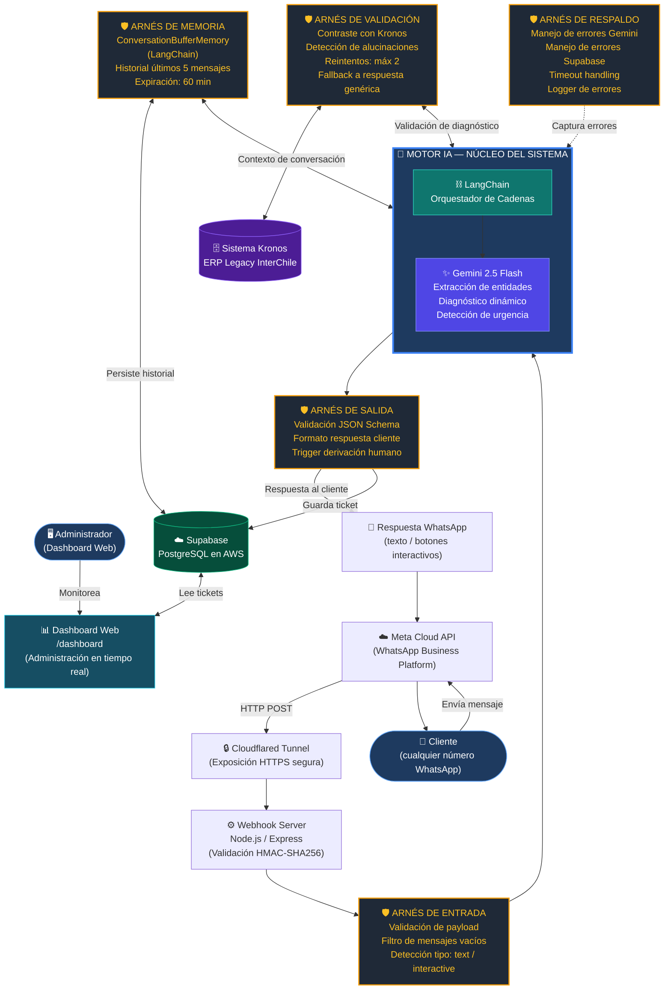
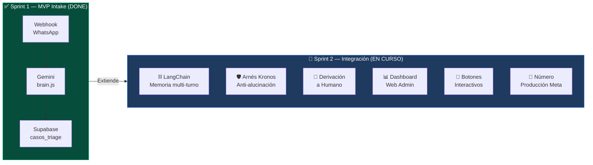
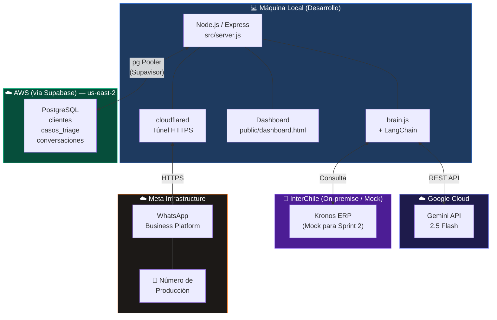

# Arquitectura del Sistema — Sprint 2 (Hito 2)

**Proyecto:** Bot Triage Comercial InterChile
**Versión:** 2.0 — Sprint 2
**Fecha:** 25 de Septiembre 2026
**Referencia:** Reunión Prof. Matías Vargas — 25 Sep 2026

> Este documento presenta la arquitectura de componentes del sistema al cierre del Sprint 2,
> siguiendo el enfoque solicitado por el Prof. Matías: **el Motor IA en el centro, rodeado
> por los arneses de validación, memoria y respaldo** que garantizan calidad y trazabilidad.

---

## Diagrama 1: Vista de Componentes (Sprint 2)

El diagrama central del sistema. Muestra el Motor IA como núcleo y los arneses que lo rodean
para controlar entradas, salidas, memoria y validación.

---

## Diagrama 2: Comparativa Sprint 1 vs Sprint 2

Muestra el crecimiento del sistema. Lo que existía antes (Sprint 1) y lo que se agrega ahora (Sprint 2).

---

## Diagrama 3: Vista de Despliegue (Infraestructura)

Dónde vive físicamente cada componente del sistema.

---

## Leyenda de Arneses

| Arnés | Propósito | HU que lo requiere |
|---|---|---|
| 🛡️ **Arnés de Entrada** | Filtra y valida todo lo que entra al sistema antes de llegar a la IA | HU-20 (Botones) |
| 🛡️ **Arnés de Memoria** | Mantiene el historial de conversación para diagnóstico multi-turno | HU-02 (Diagnóstico) |
| 🛡️ **Arnés de Validación** | Contrasta el output de la IA contra Kronos para detectar alucinaciones | HU-18 (Kronos) |
| 🛡️ **Arnés de Respaldo** | Captura errores de Gemini/Supabase sin crashear el servidor | TSK-02 |
| 🛡️ **Arnés de Salida** | Valida el JSON final y decide si derivar a humano | HU-06 (Derivación) |

---

## Contraste: ¿Se construyó como se diseñó?

> Esta sección se completa al **cierre del Sprint 2** comparando el diseño inicial
> con lo efectivamente implementado.

| Componente diseñado | ¿Implementado? | Observaciones |
|---|---|---|
| Motor IA en el centro (Gemini + LangChain) | ⏳ En progreso | LangChain pendiente de integrar |
| Arnés de Memoria | ⏳ En progreso | Subtarea de HU-02 |
| Arnés de Validación Kronos | ⏳ En progreso | HU-18 |
| Arnés de Respaldo | ⏳ En progreso | TSK-02 subtarea |
| Dashboard Web | ✅ Implementado | CP-S2-13 a CP-S2-16 pendientes de evidencia |
| Número de Producción Meta | ⏳ En gestión | Pendiente liberación SIM |
