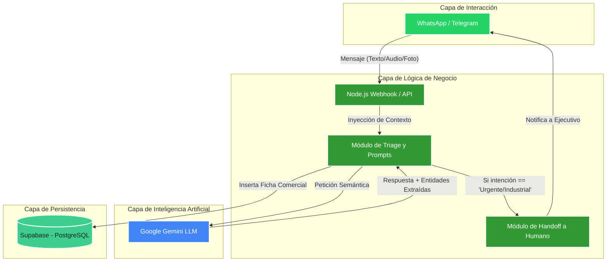

# Arquitectura Inicial v1 (Hito 1) - Bot Triage InterChile

Este documento presenta la vista de componentes y capas de la arquitectura del proyecto para el Hito 1.

## Diagrama de Componentes (Mermaid)

## Descripción de Componentes

1. **Capa de Interacción:** 
   - El cliente se comunica exclusivamente mediante una aplicación de mensajería (ej. WhatsApp).
2. **Capa de Lógica de Negocio (Node.js):**
   - **Webhook:** Recibe los eventos del cliente.
   - **Módulo Triage:** Orquesta el flujo, mantiene la memoria de la conversación y decide qué hacer.
   - **Módulo Handoff:** Encargado de detener el bot y escalar a un humano cuando el negocio lo amerita.
3. **Capa de IA (Gemini):**
   - Se encarga del procesamiento de lenguaje natural (NLP). Entiende modismos chilenos sobre aires acondicionados y extrae entidades (síntoma, marca, dirección).
4. **Capa de Persistencia (Supabase):**
   - Base de datos relacional PostgreSQL donde se almacena el resumen final (Ficha) del caso, listo para el técnico.
