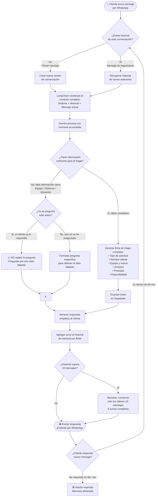

# Diagrama de Flujo de Negocio — HU-02: Diagnóstico Dinámico con Memoria Conversacional

**Proyecto:** Bot Triage Comercial InterChile
**Sprint:** Sprint 2
**Historia de Usuario:** HU-02
**Fecha:** Octubre 2026

---

## Historia de Usuario

> **Como** cliente de InterChile que contacta por WhatsApp,
> **Quiero** que el bot recuerde lo que ya le dije en mensajes anteriores de la misma conversación,
> **Para** no tener que repetir mi nombre, equipo o problema cada vez que mando un mensaje nuevo.

---

## Criterios de Aceptación (CA) cubiertos por este diagrama

| CA | Descripción |
|---|---|
| CA-1 | El bot hace una pregunta de seguimiento cuando el mensaje es vago |
| CA-3 | Si tiene suficiente información, genera el diagnóstico completo |
| CA-4 | El bot NO repite una pregunta que el cliente ya respondió en un turno anterior |

---

## Diagrama de Flujo de Negocio

---

## Explicación del Flujo por Etapas

### 1. Recepción del mensaje
El cliente envía un mensaje de texto por WhatsApp. El sistema recibe el mensaje a través del Webhook de Meta y extrae el número de teléfono como identificador único de la sesión.

### 2. Verificación de historial (Arnés de Memoria)
El sistema consulta el **mapa de conversaciones en memoria (RAM)** utilizando el número de teléfono como clave. Si existe una sesión activa de menos de 60 minutos, se recupera el historial completo de turnos anteriores.

### 3. Construcción del contexto LangChain
Se construye la cadena de mensajes para enviar a Gemini:
- **SystemMessage**: Instrucciones del rol del bot (triage InterChile)
- **HumanMessage / AIMessage**: Historial de turnos anteriores
- **HumanMessage**: El mensaje actual del cliente

Esto garantiza que Gemini tenga todo el contexto previo antes de responder.

### 4. Procesamiento con memoria (CA-4)
Gemini analiza el mensaje actual **junto con todo el historial**. Si el cliente ya mencionó su nombre en el turno 2 y en el turno 4 pregunta por otra cosa, Gemini sabe que ya tiene el nombre y **no lo vuelve a pedir**.

### 5. Evaluación de completitud
- Si la ficha tiene los datos clave (equipo, síntoma, ubicación): se genera el ticket completo y se guarda en Supabase.
- Si faltan datos: el bot pregunta solo lo que falta, sin repetir preguntas ya respondidas (CA-1, CA-4).

### 6. Actualización del historial
El nuevo turno (mensaje del cliente + respuesta del bot) se agrega al historial. Se mantiene un máximo de 10 mensajes (5 turnos) para controlar el uso de tokens.

### 7. Expiración de sesión
Si el cliente no envía un mensaje nuevo en 60 minutos, la sesión expira y la memoria se elimina. El próximo mensaje se trata como una conversación nueva.

---

## Evidencia de Funcionamiento (Sprint 2)

Prueba multi-turno ejecutada el **29 de septiembre 2026**:

| Turno | Mensaje cliente | Bot recuerda... | Respuesta bot |
|---|---|---|---|
| 1 | "hola buen día" | — | Saluda y pregunta el motivo |
| 2 | "soy Carlos, de la sucursal de Reñaca" | — | Reconoce nombre + ubicación |
| 3 | "el split samsung no está enfriando" | Carlos / Reñaca ✅ | No repite nombre ni ubicación, pide dirección exacta |
| 4 | "es urgente, hay clientes" | Carlos / Reñaca / Samsung ✅ | Escala prioridad a **Alta**, confirma envío de técnico |

**Resultado:** CA-4 verificado — el bot nunca volvió a preguntar por datos ya proporcionados.

---

## Asociación con Código Fuente

| Elemento del diagrama | Archivo | Función |
|---|---|---|
| Mapa de conversaciones | `src/brain.js` | `const conversaciones = new Map()` |
| Verificar historial | `src/brain.js` | `obtenerContexto(telefono)` |
| Construir contexto LangChain | `src/brain.js` | Array `mensajes` con SystemMessage + historial |
| Procesar con Gemini | `src/brain.js` | `llmEstructurado.invoke(mensajes)` |
| Guardar ticket | `src/db.js` | `guardarCasoTriage(ficha, telefono)` |
| Expiración 60 min | `src/brain.js` | `TIEMPO_EXPIRACION_MS = 60 * 60 * 1000` |
